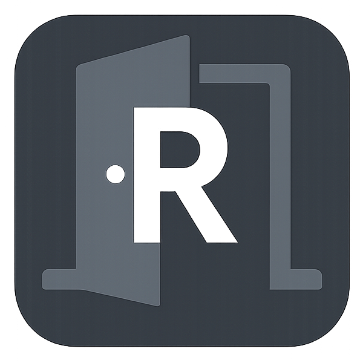

<p align="center">
  
</p>

<h1 align="center">Sistema de Reserva de Salas</h1>

<p align="center">
  <strong>Atividade Prática - DevSecOps · SDLC Etapa 4: Projeto e Implementação</strong>
</p>

<p align="center">
  <a href="https://laravel.com"></a>
  <a href="https://php.net"></a>
  <a href="https://docker.com"></a>
  <a href="LICENSE"></a>
</p>


---

## 📋 Sumário

- [Sobre o Projeto](#-sobre-o-projeto)
- [Funcionalidades](#-funcionalidades)
- [Stack Tecnológica](#-stack-tecnológica)
- [Instalação](#-instalação)
- [Configuração](#-configuração)
- [Uso](#-uso)
- [Controle de Acesso (ACL)](#-controle-de-acesso-acl)
- [Estrutura do Projeto](#-estrutura-do-projeto)
- [Licença](#-licença)

---

## 🎯 Sobre o Projeto

**Sistema de Reserva de Salas** desenvolvido como atividade prática da disciplina de **DevSecOps**, contemplando a **Etapa 4 do SDLC - Projeto e Implementação**.

O sistema permite que usuários autenticados realizem reservas de salas de reunião com controle de disponibilidade, enquanto administradores gerenciam todo o ciclo de vida das reservas e acompanham estatísticas no painel.

### Contexto acadêmico

| Campo | Detalhe |
|---|---|
| Disciplina | DevSecOps |
| Etapa SDLC | 4 - Projeto e Implementação |
| Framework | Laravel 13 |
| Padrão arquitetural | MVC |

---

## ✨ Funcionalidades

### 📅 Reservas de Salas
- Listagem de salas disponíveis com capacidade e descrição
- Criação de reservas com verificação de conflito de horário
- Visualização de todas as reservas do sistema
- Edição de reservas (administradores)
- Cancelamento (soft) de reservas (administradores)
- Exclusão permanente de reservas (administradores)

### 📊 Painel Administrativo (Programador / Administrador)
- Total de salas cadastradas
- Reservas ativas no sistema
- Reservas para o dia corrente
- Reservas nos próximos 7 dias
- Total de reservas canceladas
- Acessos diários e usuários online

### 🔐 Segurança
- Autenticação multifator (Google 2FA)
- Controle de acesso granular (ACL - Spatie Laravel Permission)
- Autenticação JWT para APIs
- Validação de formulários e proteção CSRF
- Verificação de sobreposição de horários na reserva

### 🎨 Interface
- AdminLTE 3 - tema administrativo responsivo
- DataTables com exportação (CSV, Excel, PDF, Impressão)
- Select2 para seleção de salas e status
- PWA Ready

---

## 🛠️ Stack Tecnológica

| Camada | Tecnologia |
|---|---|
| Backend | Laravel 13 · PHP 8.3+ |
| Banco de dados | MySQL 8 |
| Autenticação | JWT · Laravel Sanctum · Google 2FA |
| ACL | Spatie Laravel Permission |
| Frontend | AdminLTE 3 · Bootstrap 5 · Vite · SASS |
| Tabelas | Yajra DataTables (server-side e client-side) |
| Seleção | Select2 |
| Containerização | Docker · Laravel Sail |
| Testes | PEST |
| Cache | Redis |

---

## 🚀 Instalação

### Pré-requisitos
- **Docker** e **Docker Compose**
- **Node.js** 18+
- **Composer**

### Passo a passo

```bash
# 1. Clone o repositório
git clone https://github.com/brito101/room-reservations.git
cd room-reservations

# 2. Copie o arquivo de ambiente
cp .env.example .env

# 3. Instale as dependências PHP
composer install

# 4. Instale as dependências JS
npm install

# 5. Gere as chaves da aplicação
php artisan key:generate
php artisan jwt:secret

# 6. Configure o alias do Sail (opcional)
alias sail='[ -f sail ] && sh sail || sh vendor/bin/sail'

# 7. Suba os containers
sail up -d

# 8. Execute as migrations e seeders
sail artisan migrate --seed

# 9. Crie o link simbólico de storage
sail artisan storage:link

# 10. Compile os assets
npm run build
```

---

## ⚙️ Configuração

### Variáveis de ambiente principais

```env
APP_NAME="Reserva de Salas"
APP_ENV=local
APP_URL=http://localhost

DB_CONNECTION=mysql
DB_DATABASE=room_reservations
DB_USERNAME=root
DB_PASSWORD=

JWT_SECRET=          # gerado por artisan jwt:secret
JWT_TTL=60

REDIS_HOST=127.0.0.1
REDIS_PORT=6379
```

### Infraestrutura Docker (docker-compose.yml)

| Serviço | Função |
|---|---|
| `laravel.test` | Aplicação Laravel (PHP 8.3) |
| `mysql` | Banco de dados MySQL 8 |
| `redis` | Cache e sessões |
| `meilisearch` | Busca full-text |
| `mailpit` | Teste de e-mails |
| `selenium` | Testes automatizados |

---

## 🎮 Uso

### Credenciais padrão

| Papel | E-mail | Senha |
|---|---|---|
| Programador | programador@base.com | 12345678 |
| Administrador | admin@base.com | 12345678 |
| Usuário | user@base.com | 12345678 |

### Comandos úteis

```bash
# Iniciar ambiente
sail up -d

# Parar ambiente
sail down

# Compilar assets (desenvolvimento)
npm run dev

# Compilar assets (produção)
npm run build

# Migrations
sail artisan migrate

# Seeders (incluindo salas)
sail artisan db:seed

# Seeders de teste de reservas (apenas ambiente local)
sail artisan db:seed --class=ReservationTestSeeder

# Cache de configuração (produção)
sail artisan config:cache
sail artisan route:cache
```

### Navegando pelo sistema

| Rota | Descrição |
|---|---|
| `/admin/home` | Dashboard (estatísticas visíveis por papel) |
| `/admin/reservations` | Lista e criação de reservas |
| `/admin/reservations/{id}/edit` | Editar reserva (somente admin) |

---

## 🔒 Controle de Acesso (ACL)

O sistema possui três papéis com permissões distintas:

| Papel | Criar Reserva | Ver Reservas | Editar / Cancelar / Excluir | Estatísticas no Dashboard |
|---|:---:|:---:|:---:|:---:|
| Programador | ✅ | ✅ | ✅ | ✅ |
| Administrador | ✅ | ✅ | ✅ | ✅ |
| Usuário | ✅ | ✅ | ❌ | ❌ |

As estatísticas do painel (acessos diários, usuários online, contadores de reservas) são computadas no controller e renderizadas na view **somente** para os papéis `Programador` e `Administrador`.

---

## 📁 Estrutura do Projeto

```
app/
├── Http/
│   ├── Controllers/
│   │   ├── Admin/
│   │   │   ├── AdminController.php       # Dashboard
│   │   │   ├── ReservationController.php # CRUD de reservas
│   │   │   └── ACL/                      # Controle de acesso
│   │   └── Api/                          # REST APIs (JWT)
│   └── ...
├── Models/
│   ├── Room.php                          # Modelo de salas
│   ├── Reservation.php                   # Modelo de reservas
│   └── User.php
database/
├── migrations/
│   ├── ..._create_rooms_table.php
│   └── ..._create_reservations_table.php
└── seeders/
    ├── RoomSeeder.php                    # 4 salas padrão
    └── ReservationTestSeeder.php         # Dados de teste (local)
resources/views/admin/
├── home/index.blade.php                  # Dashboard
└── reservations/
    ├── index.blade.php                   # Lista + formulário
    └── edit.blade.php                    # Edição
```

---

## 📄 Licença

Este projeto está licenciado sob a **MIT License**.

---

<p align="center">
  Desenvolvido como atividade prática de <strong>DevSecOps</strong> - SDLC Etapa 4.
</p>

