# Sumário do Resultado — Design e Implementação do Software de Reserva de Salas

| Campo        | Valor                                   |
|--------------|-----------------------------------------|
| **Disciplina** | DevSecOps                             |
| **Etapa SDLC** | 4 — Projeto e Implementação           |
| **Autor**      | [Seu Nome]                            |
| **Data**       | 07 de maio de 2026                    |
| **Repositório**| github.com/brito101/base-laravel-13   |

---

## Objetivo

Desenvolver um sistema web de **Reserva de Salas** aplicando as fases do SDLC (*Software Development Life Cycle*), com foco na **Etapa 4 — Projeto e Implementação**. O sistema deve permitir que usuários autenticados realizem e gerenciem reservas de salas de reunião, com controles de acesso distintos por perfil.

---

## Passo 1 — Identificação das Fases do SDLC

O desenvolvimento do sistema seguiu as seis fases clássicas do SDLC, adaptadas ao contexto acadêmico da disciplina de DevSecOps:

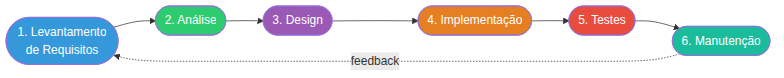

| Fase | Atividades Realizadas |
|---|---|
| **1. Levantamento de Requisitos** | Leitura da especificação da atividade; identificação das funcionalidades obrigatórias (autenticação, reserva, listagem, cancelamento) e opcionais (ACL por perfil, conflito de horário, dashboard) |
| **2. Análise** | Definição dos papéis (Programador, Administrador, Usuário); análise de viabilidade com o framework Laravel 13 já disponível; identificação de riscos como sobreposição de reservas |
| **3. Design** | Modelagem do banco de dados (ER); definição das rotas REST; wireframes das telas principais; diagrama de casos de uso |
| **4. Implementação** | Codificação dos modelos, controladores, Form Requests, views e seeders; integração com AdminLTE 3 e Spatie Permissions |
| **5. Testes** | Testes manuais de fluxo completo (criação, edição, cancelamento, exclusão); verificação de regras de conflito; validação de ACL por perfil |
| **6. Manutenção** | Ajustes de UX (botões condicionais por perfil/status); adição de gráfico de métricas no dashboard; revisão das regras de negócio (reservas canceladas imutáveis) |

---

## Passo 2 — Papéis e Responsabilidades

### Papéis no processo de desenvolvimento (SDLC)

| Papel | Responsabilidades |
|---|---|
| **Analista de Requisitos** | Coleta e documentação dos requisitos funcionais e não funcionais; alinhamento com o enunciado da atividade |
| **Arquiteto de Software** | Definição da arquitetura MVC, escolha do stack tecnológico (Laravel 13, AdminLTE 3, MySQL, Redis), modelagem ER |
| **Desenvolvedor Back-end** | Implementação de modelos Eloquent, controladores, Form Requests, regras de negócio, seeders e migrations |
| **Desenvolvedor Front-end** | Construção das views Blade com AdminLTE 3, integração de DataTables, Select2 e Chart.js |
| **Especialista em Segurança (DevSecOps)** | Configuração de autenticação (JWT, 2FA), ACL com Spatie Permissions, proteção CSRF, validação de entradas |
| **Testador (QA)** | Elaboração e execução do plano de testes manuais; validação de cenários de borda (conflito de horário, permissões) |

### Perfis de usuário do sistema (ACL)

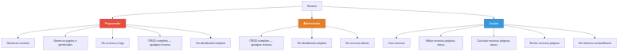

---

## Passo 3 — Levantamento de Requisitos

### Requisitos Funcionais

| ID | Requisito | Perfil |
|----|-----------|--------|
| RF01 | O sistema deve autenticar usuários com e-mail e senha | Todos |
| RF02 | O sistema deve suportar autenticação em dois fatores (Google 2FA) | Todos |
| RF03 | O usuário deve poder criar uma reserva de sala para uma data e horário específicos | Todos |
| RF04 | O sistema deve verificar conflito de horário ao criar ou editar uma reserva | Todos |
| RF05 | O usuário deve poder listar todas as reservas existentes no sistema | Todos |
| RF06 | O usuário deve poder editar suas próprias reservas ativas | Usuário / Admin |
| RF07 | O usuário deve poder cancelar suas próprias reservas ativas | Usuário / Admin |
| RF08 | O usuário deve poder excluir suas próprias reservas | Usuário / Admin |
| RF09 | O administrador deve poder alterar o status de qualquer reserva | Admin / Programador |
| RF10 | Reservas com status *cancelada* não devem ser editadas por nenhum perfil | Todos |
| RF11 | O dashboard deve exibir estatísticas de reservas para todos os perfis | Todos |
| RF12 | O dashboard deve exibir gráfico de reservas por mês (últimos 12 meses) | Todos |
| RF13 | O dashboard administrativo deve exibir acessos diários e usuários online | Admin / Programador |
| RF14 | O sistema deve registrar exclusões de forma lógica (*soft delete*) | Sistema |

### Requisitos Não Funcionais

| ID | Requisito | Categoria |
|----|-----------|-----------|
| RNF01 | Interface responsiva e funcional em dispositivos móveis | Usabilidade |
| RNF02 | Respostas do servidor inferiores a 2 segundos em operações normais | Desempenho |
| RNF03 | Senhas armazenadas com hash bcrypt | Segurança |
| RNF04 | Todas as rotas protegidas por autenticação e middleware de acesso | Segurança |
| RNF05 | Proteção CSRF em todos os formulários | Segurança |
| RNF06 | Chaves primárias do tipo UUID v4 (não sequenciais) | Segurança / Privacidade |
| RNF07 | Ambiente containerizado via Docker / Laravel Sail | Infraestrutura |
| RNF08 | Banco de dados MySQL 8 com Redis para cache e sessões | Infraestrutura |
| RNF09 | Cobertura de testes com framework PEST | Qualidade |
| RNF10 | Código organizado no padrão MVC com separação de responsabilidades | Manutenibilidade |

---

## Passo 4 — Design e Implementação

### Arquitetura do Sistema

O sistema adota o padrão **MVC (Model-View-Controller)** do framework Laravel 13, com camadas adicionais de Form Requests (validação) e Middleware (autenticação e autorização).

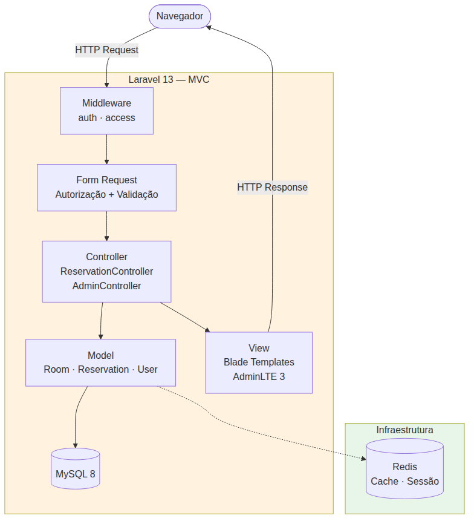

### Modelo de Dados (Diagrama ER)

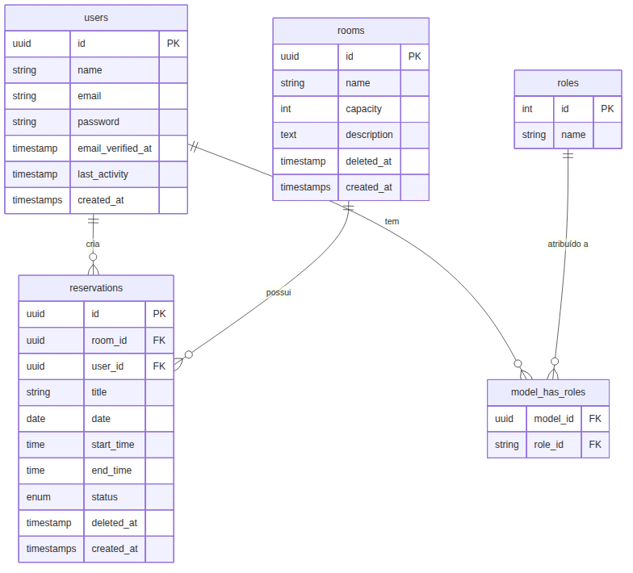

> **Nota:** `status` é um `ENUM('ativa', 'cancelada')`. Exclusões são lógicas (*soft delete*) via coluna `deleted_at`.

### Diagrama de Casos de Uso

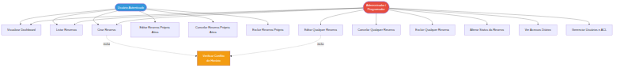

### Fluxo de Criação de Reserva (Diagrama de Sequência)

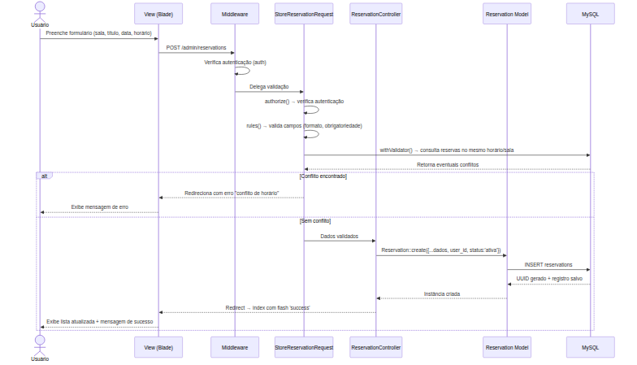

### Regras de Negócio — Controle de Acesso

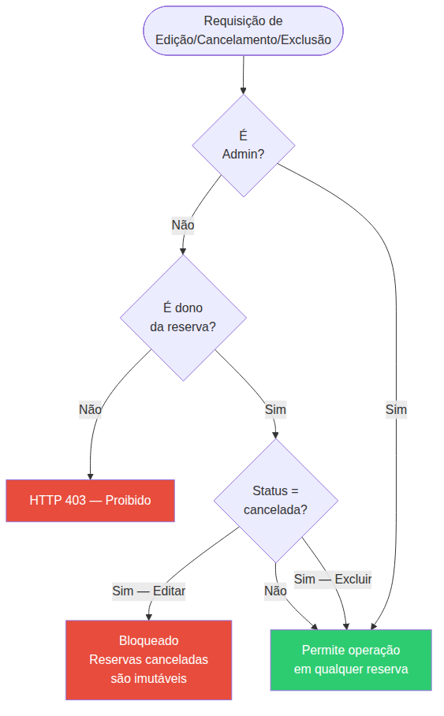

### Stack Tecnológico

| Camada | Tecnologia | Versão |
|--------|-----------|--------|
| Linguagem | PHP | 8.3+ |
| Framework | Laravel | 13.x |
| Banco de dados | MySQL | 8.0 |
| Cache / Sessão | Redis | 7.x |
| UI Framework | AdminLTE | 3.x |
| CSS | Bootstrap + SASS | 5.x |
| Build | Vite | 5.x |
| Tabelas | Yajra DataTables | 11.x |
| Gráficos | Chart.js | 3.x |
| ACL | Spatie Laravel Permission | 6.x |
| Autenticação API | JWT (tymon/jwt-auth) | 2.x |
| 2FA | pragmarx/google2fa | 8.x |
| Containerização | Docker / Laravel Sail | — |
| Testes | PEST | 3.x |

### Telas do Sistema

---

**Tela 1 — Login**

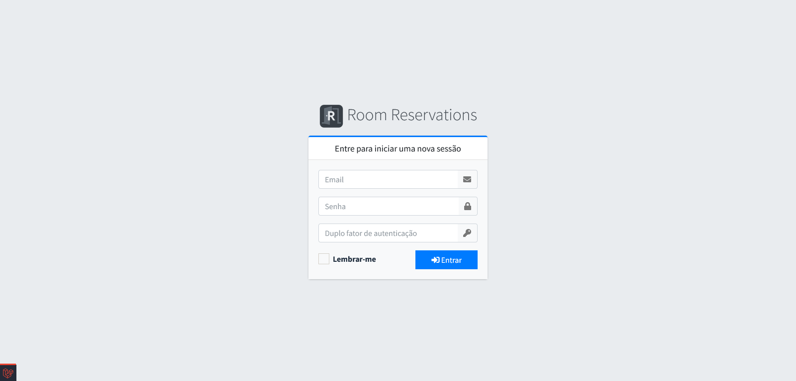

---

**Tela 2 — Dashboard (perfil Administrador)**

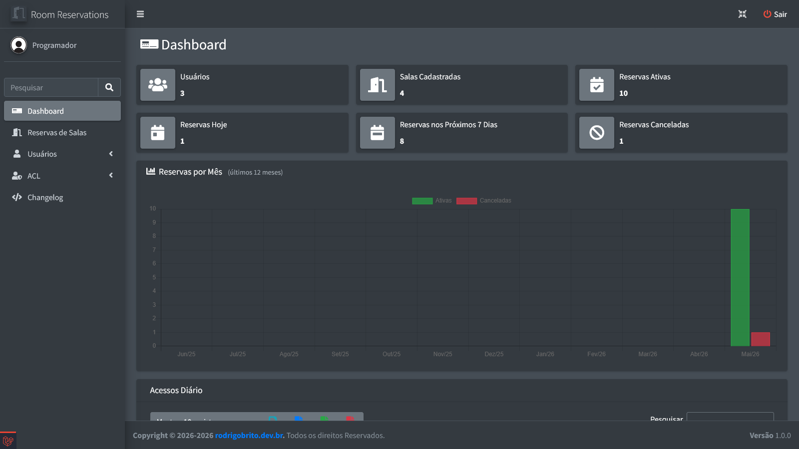
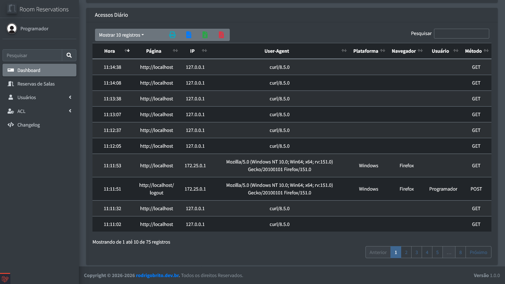
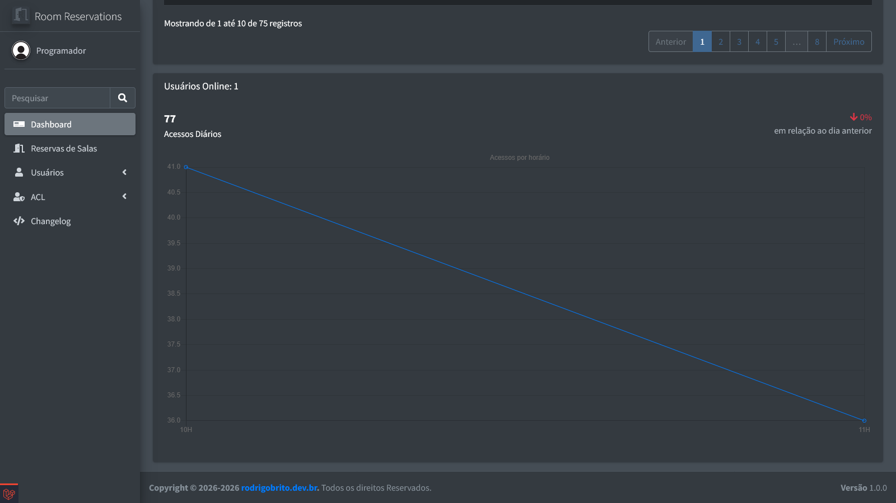

---

**Tela 3 — Dashboard (perfil Usuário básico)**

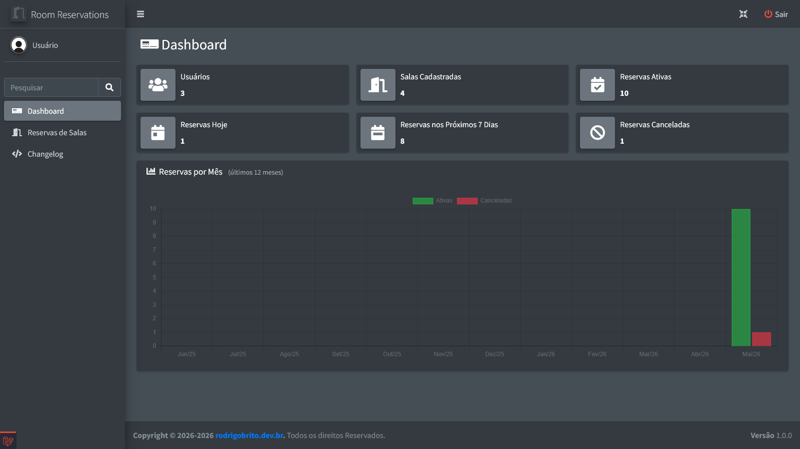

---

**Tela 4 — Lista de Reservas (perfil Usuário básico)**

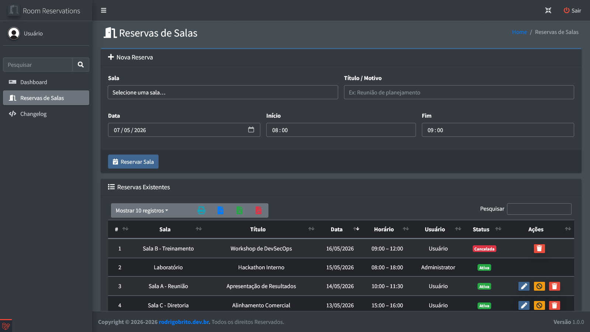
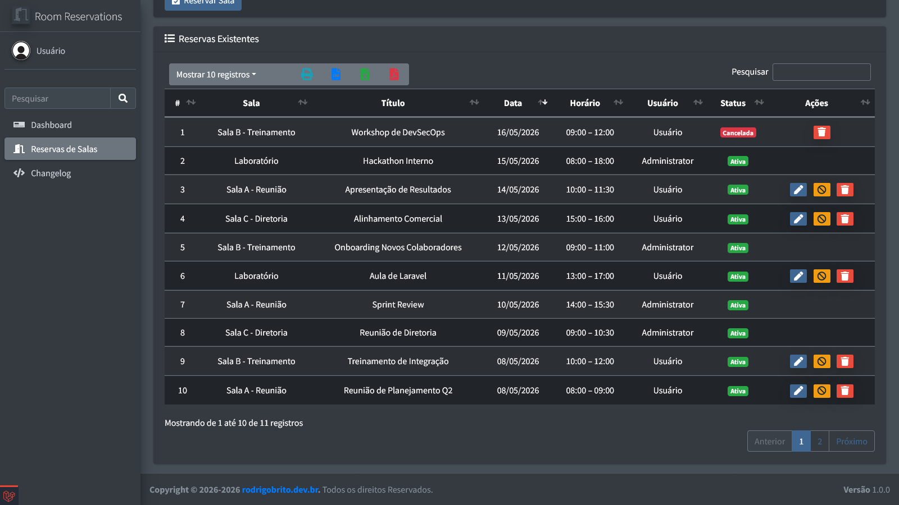

---

**Tela 5 — Formulário de Nova Reserva**

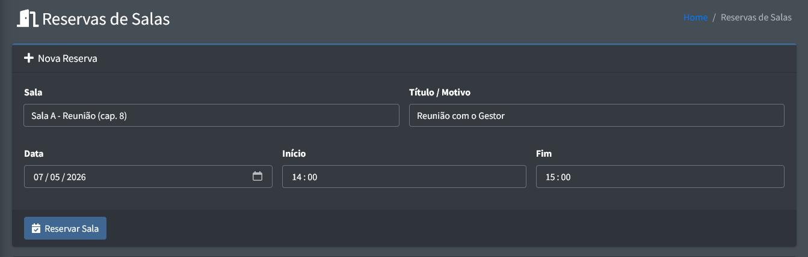
---

**Tela 6 — Validação de Conflito de Horário**

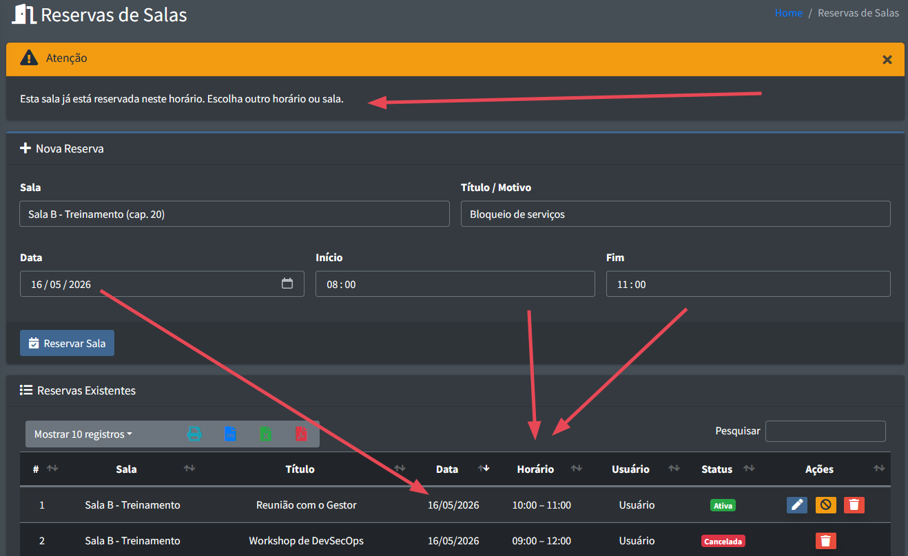

---

**Tela 7 — Formulário de Edição (perfil Administrador)**

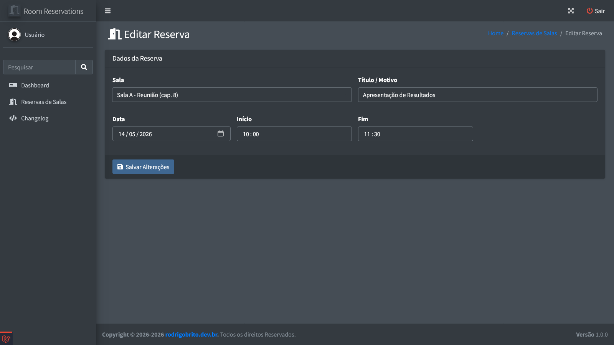


---

### Principais decisões de implementação

**UUID como chave primária:** todos os modelos (`User`, `Room`, `Reservation`) utilizam UUIDs v4 gerados automaticamente pelo trait `HasUuids` do Laravel, evitando enumeração sequencial de recursos na URL (requisito de segurança RNF06).

**Soft Delete:** exclusões lógicas via `SoftDeletes` preservam o histórico de reservas no banco. A exclusão definitiva (`forceDelete`) é acionada explicitamente pelos botões "Excluir" da interface.

**Form Requests como camada de validação:** `StoreReservationRequest` e `UpdateReservationRequest` centralizam regras de validação, autorização e verificação de sobreposição de horário, mantendo os controladores enxutos.

**Regra de conflito de horário** — lógica aplicada em `withValidator()`:

```
Conflito = mesma sala + mesma data + status 'ativa'
         + (inicio_existente < fim_nova) E (fim_existente > inicio_nova)
```

**Imutabilidade de reservas canceladas:** reservas com `status = 'cancelada'` não podem ser editadas por nenhum perfil. A restrição é aplicada em três camadas: *view* (botão oculto), *controller* (redirecionamento) e *Form Request* (HTTP 403).

---

## Passo 5 — Plano de Testes

### Cenários de teste

| ID | Cenário | Dados de entrada | Resultado esperado |
|----|---------|------------------|--------------------|
| T01 | Login com credenciais válidas | `user@base.com` / `12345678` | Redireciona para `/admin` |
| T02 | Login com senha incorreta | `user@base.com` / `errada` | Mensagem de erro, permanece em `/login` |
| T03 | Criar reserva válida | Sala A, "Reunião", 2026-05-10, 09:00–10:00 | Reserva criada, status *ativa*, aparece na lista |
| T04 | Criar reserva com conflito de horário | Mesma sala, mesma data, 09:30–10:30 | Erro "conflito de horário", reserva **não** criada |
| T05 | Criar reserva em data passada | Data: 2026-01-01 | Erro de validação "a data deve ser hoje ou futura" |
| T06 | Editar reserva própria ativa (Usuário) | Alterar título | Reserva atualizada com sucesso |
| T07 | Editar reserva de outro usuário (Usuário) | Acessar URL diretamente | HTTP 403 — Proibido |
| T08 | Editar reserva cancelada (qualquer perfil) | Acessar URL diretamente | Redirecionado com mensagem de erro |
| T09 | Cancelar reserva própria ativa | Clicar em "Cancelar" | Status muda para *cancelada*, botão de editar some |
| T10 | Cancelar reserva já cancelada (Usuário) | Acessar URL diretamente | HTTP 403 — Proibido |
| T11 | Excluir reserva própria | Clicar em "Excluir" + confirmar | Reserva removida da lista (forceDelete) |
| T12 | Excluir reserva de outro usuário (Usuário) | Requisição DELETE direta | HTTP 403 — Proibido |
| T13 | Admin edita reserva de outro usuário | Clicar em "Editar" | Formulário exibido; campo Status visível |
| T14 | Admin altera status de reserva ativa para cancelada | Selecionar "Cancelada" + Salvar | Status atualizado; botão Editar some na lista |
| T15 | Dashboard exibe gráfico de barras (Usuário) | Login como `user@base.com` | Gráfico "Reservas por Mês" renderizado |
| T16 | Dashboard exibe tabela de acessos (Admin) | Login como `admin@base.com` | Tabela "Acessos Diário" visível com dados |

---

## Conclusão

O **Sistema de Reserva de Salas** foi desenvolvido com sucesso aplicando todas as fases do SDLC. A solução entregue supera os requisitos mínimos da atividade ao incorporar:

- **Controle de acesso granular** por três perfis distintos (Programador, Administrador, Usuário)
- **Validação de conflito de horário** em múltiplas camadas (Form Request + banco de dados)
- **Imutabilidade de reservas canceladas** aplicada em view, controller e FormRequest
- **Dashboard com métricas** úteis para todos os perfis, incluindo gráfico histórico por mês
- **Segurança** com UUIDs, CSRF, autenticação 2FA e proteção em todas as rotas
- **Containerização** completa com Docker/Sail para reprodutibilidade do ambiente

A arquitetura MVC do Laravel 13, combinada com Form Requests e Spatie Permissions, garantiu separação clara de responsabilidades e facilidade de manutenção, refletindo práticas reais de ambientes corporativos.
